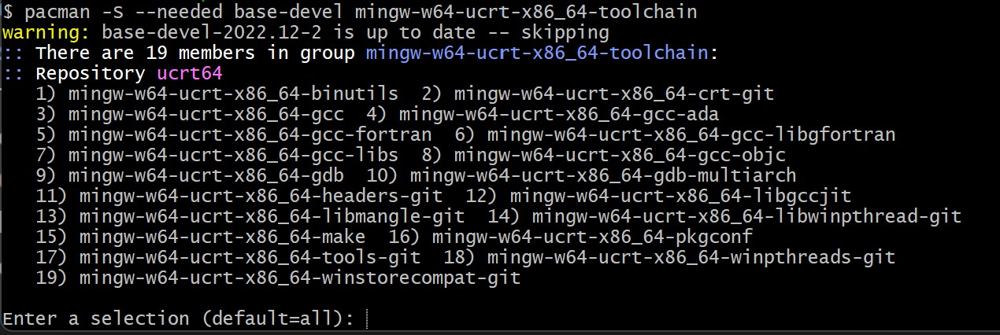

# Windows上编译环境的安装
> 现在主流的C++工具有两款，一款是Visual Studio（简称VS）、一款是Visual Studio Code（简称VScode）。我认为在你工作之前使用VSCode，对你的电脑和使用体验会友善许多！
## VSCode的安装和配置（去找B站上的教程会使你变得轻松）
1. 下载安装VSCode
    * [VSCode下载地址](https://code.visualstudio.com/download)
    * 安装相关插件：
        * 中文语言包,如果你的英语足够好，可以跳过这一步 
        * C/C++ 
        * CodeRunner 
2. 下载安装MinGW
   * [MinGW下载地址](https://github.com/msys2/msys2-installer/releases/download/2024-01-13/msys2-x86_64-20240113.exe)
        > 下载好之后一直点击next就好了，然后他会打开命令窗口输入如下命令
        ```
        pacman -S --needed base-devel mingw-w64-ucrt-x86_64-toolchain
        ```
        回车加上Y 即可
           
        将MinGW的bin目录添加到环境变量中
        > 如果不出意外应该是 C:\msys64\ucrt64\bin

        使用以下指令测试是否配置成功
        ```
        gcc --version
        g++ --version
        gdb --version
        ```
        如果没有报错，那么恭喜你，MinGW安装成功！
        
        
3. 配置VSCode
    * 按住Ctrl Shift + P 输入C/C++ 找到编辑配置（UI）  
    >按照如下配置

    

## Hello World!
### 试着创建一个cpp文件，例如Hello.cpp,填上相关代码，然后右键运行Run Code！